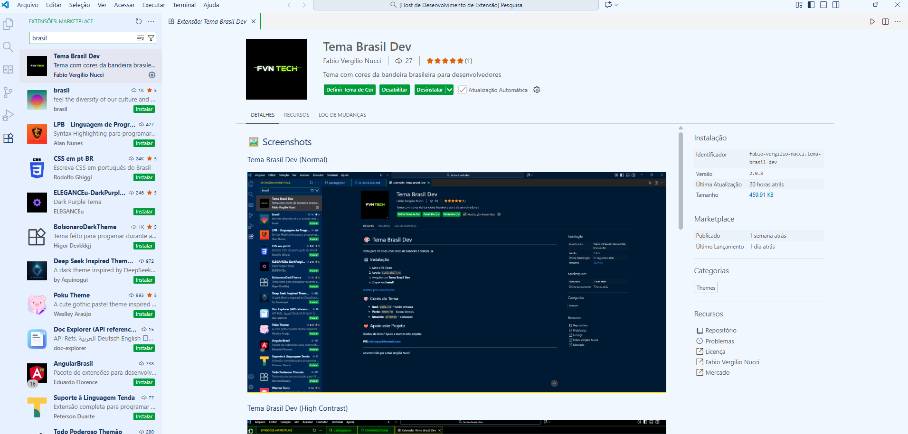

# Tema Brasil Dev

Tema para VS Code com cores da bandeira brasileira 🇧🇷

## 🎨 Variantes do Tema

### 🌎 Tema Brasil Dev International
- **Para quem:   ** Desenvolvedores globais e times internacionais
- **Cores:   ** Mesmo esquema do tema normal, mas com metadados em inglês

### 🇧🇷 Tema Brasil Dev (Normal)

- **Para quem:  ** Uso geral no dia a dia
- **Cores:   ** Esquema escuro com cores da bandeira brasileira

### 👁️ Tema Brasil Dev High Contrast

- **Para quem:   ** Acessibilidade, baixa visão, ambientes muito claros
- **Cores:   ** Alto contraste mantendo a identidade brasileira

### 🌞 Tema Brasil Dev Light

*Para quem:* Prefere temas claros, ambientes bem iluminados  
*Cores:* Versão clara mantendo as cores da bandeira brasileira

## 🚀 Instalação

1. Abra o VS Code
2. Pressione `Ctrl+Shift+X` (Windows/Linux) ou `Cmd+Shift+X` (Mac)
3. Pesquise por "Tema Brasil Dev"
4. Clique em **Install**

## 🎯 Como Usar

Após a instalação:

1. Pressione `Ctrl+K Ctrl+T` (Windows/Linux) ou `Cmd+K Cmd+T` (Mac)
2. Selecione uma das opções:

### 🌞 Tema Brasil Dev Light
### 👁️ Tema Brasil Dev High Contrast (Versão Acessível)
### 🇧🇷 Tema Brasil Dev (Normal)
### 🌎 Tema Brasil Dev International

[Instalar pelo Marketplace](https://marketplace.visualstudio.com/items?itemName=fabio-vergilio-nucci.tema-brasil-dev)

## 🎨 Cores do Tema

Azul: #002776 - (fundo principal)

Verde: #009C3B - (barras laterais e elementos UI)

Amarelo: #FFDF00 - (destaques e sintaxe)

👋 Apoie a Manutenção e a Evolução do Tema Brasil Dev!

Este tema é e será sempre 100% gratuito para a comunidade. Se você gostou da constante dedicação e das novas funcionalidades (como o Tema High Contrast e a versão internacional), você pode apoiar nosso trabalho de manutenção voluntariamente.

Sua contribuição garante que o projeto continue evoluindo!

⭐ PIX para Suporte Voluntário (FVN Tech): fabiosjrp@hotmail.com

*Desenvolvido por Fabio Vergilio Nucci e equipe *

