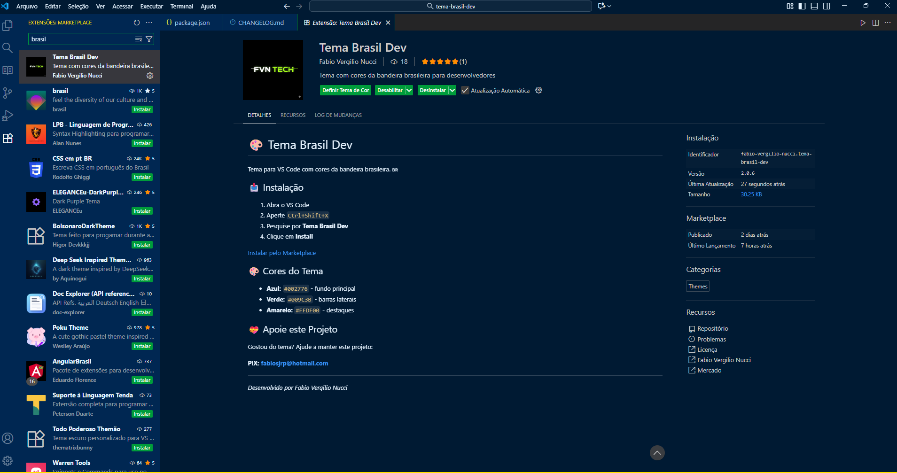
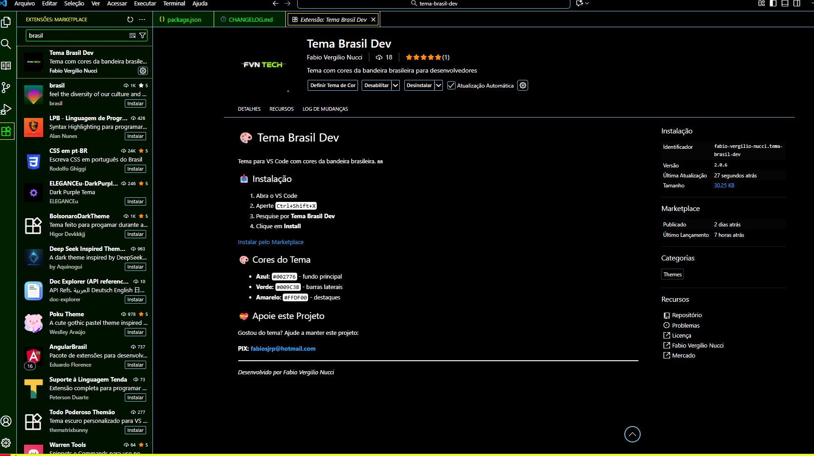

# Tema Brasil Dev

Tema para VS Code com cores da bandeira brasileira 🇧🇷

## 🎨 Variantes do Tema

### 🇧🇷 Tema Brasil Dev (Normal)

- **Para quem:  ** Uso geral no dia a dia
- **Cores:   ** Esquema escuro com cores da bandeira brasileira

### 🌎 Brazil Colors (International)
- **Para quem:   ** Desenvolvedores globais e times internacionais
- **Cores:   ** Mesmo esquema do tema normal, mas com metadados em inglês

### 👁️ Tema Brasil Dev High Contrast

- **Para quem:   ** Acessibilidade, baixa visão, ambientes muito claros
- **Cores:   ** Alto contraste mantendo a identidade brasileira

## 🚀 Instalação

1. Abra o VS Code
2. Pressione `Ctrl+Shift+X` (Windows/Linux) ou `Cmd+Shift+X` (Mac)
3. Pesquise por "Tema Brasil Dev"
4. Clique em **Install**

## 🎯 Como Usar

Após a instalação:

1. Pressione `Ctrl+K Ctrl+T` (Windows/Linux) ou `Cmd+K Cmd+T` (Mac)
2. Selecione uma das opções:

   - **Tema Brasil Dev** (versão normal)
   - **Tema Brasil Dev High Contrast** (versão acessível)

[Instalar pelo Marketplace](https://marketplace.visualstudio.com/items?itemName=fabio-vergilio-nucci.tema-brasil-dev)

## 🎨 Cores do Tema

Azul: #002776 - (fundo principal)

Verde: #009C3B - (barras laterais e elementos UI)

Amarelo: #FFDF00 - (destaques e sintaxe)

## 💚 Apoie a Evolução Contínua do Tema Brasil Dev

O **Tema Brasil Dev é e sempre será 100% gratuito** para todos os desenvolvedores.

Este projeto é mantido por **Fabio Vergilio Nucci (FVN Tech)**, com dedicação à comunidade.

**Se você puder e quiser nos apoiar**, sua contribuição é reinvestida diretamente para:

1.  **Garantir a Compatibilidade:** Manutenção e correção de bugs em novas versões do VS Code.
2.  **Aprimorar a Acessibilidade:** Expandir as opções de contraste e cores (como o High Contrast).
3.  **Desenvolver Novos Recursos:** Lançar variações e suporte para mais linguagens.

⭐ **CONTRIBUIÇÃO VOLUNTÁRIA (Chave PIX):** fabiosjrp@hotmail.com **

*Desenvolvido por Fabio Vergilio Nucci*

